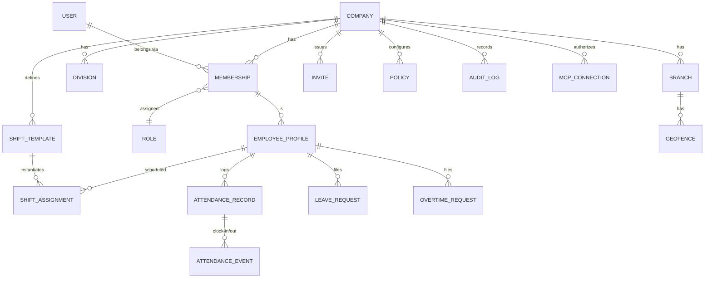
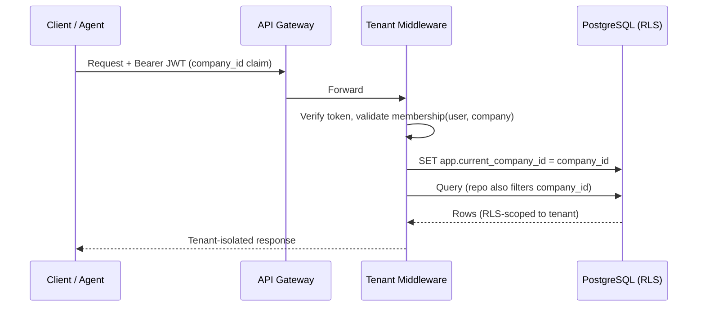
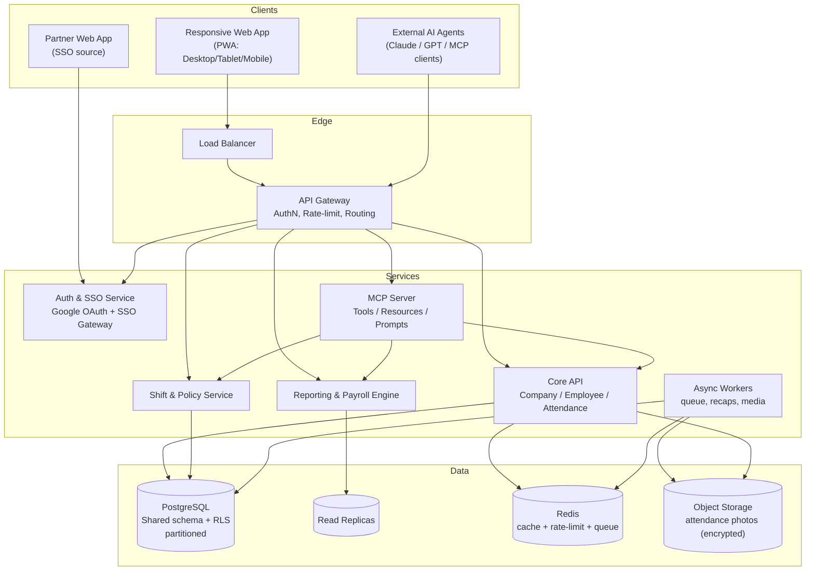
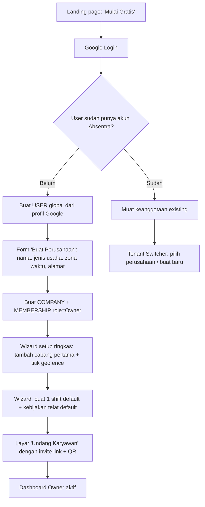
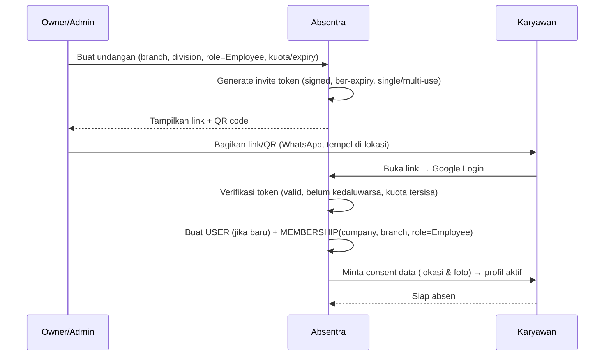
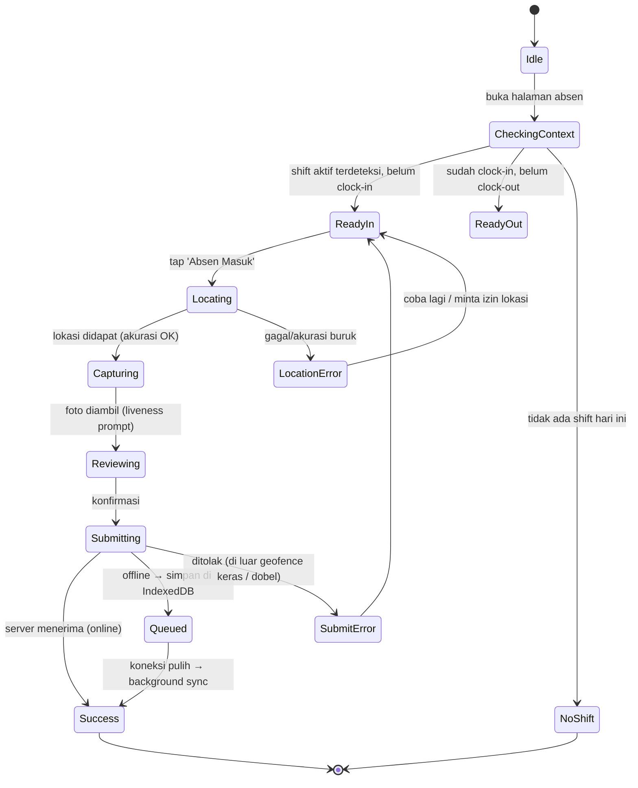
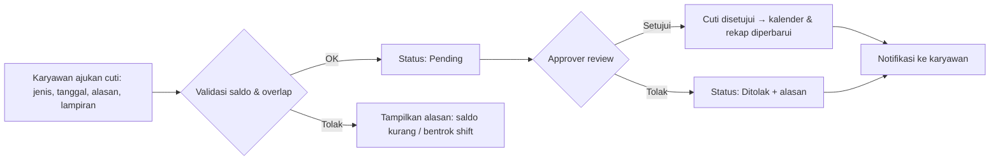
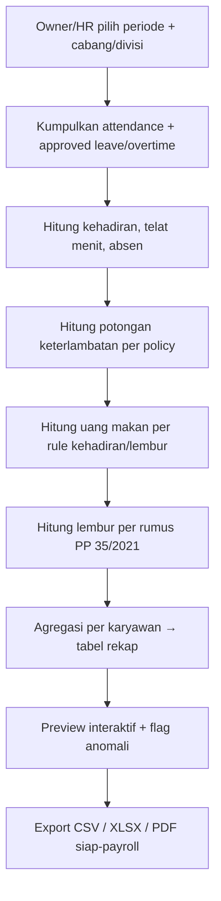

# Product Requirements Document (PRD)
## Absentra — B2B SaaS Multi-Tenant Attendance Platform untuk UMKM Indonesia

---

| Field | Value |
|---|---|
| **Nama Produk** | Absentra |
| **Tagline** | *Absensi enterprise-grade, gratis, untuk setiap UMKM Indonesia.* |
| **Versi Dokumen** | 1.0 |
| **Status** | Draft for Engineering Review |
| **Kelas Produk** | B2B SaaS, Multi-Tenant, Web-First, Agentic-Native (MCP) |
| **Model Bisnis** | 100% Free (zero-cost untuk seluruh tenant) |
| **Platform** | Web Application (Responsive: Desktop / Tablet / Mobile Web) — tanpa native app |
| **Target Pembaca** | Engineering, Product, Design, QA, DevOps/SRE, Security, dan AI Agent integrator |
| **Document Owner** | Chief Product Officer |

---

## Daftar Isi

1. Executive Summary
2. Deep Research: Problem Space & Market Analysis
3. Product Strategy, Scope & Success Metrics
4. Multi-Tenant Architecture Overview
5. User Roles & RBAC (Role-Based Access Control)
6. End-to-End User Flows
7. Feature Breakdown (Level Atomik per Modul)
8. UI/UX Guidelines (Component, State Management, Touch Interaction)
9. Non-Functional Requirements (NFR)
10. Data Model Appendix
11. API Surface & MCP Mapping
12. Roadmap & Phasing
13. Risks & Mitigations
14. Open Questions

---

# 1. Executive Summary

## 1.1 Visi Produk

Absentra adalah platform absensi berbasis web yang dirancang sebagai **system of record kehadiran** untuk Usaha Mikro, Kecil, dan Menengah (UMKM) di Indonesia. Produk ini menggantikan tiga praktik yang masih dominan di lapangan — buku absen manual, spreadsheet yang dikelola tangan, dan mesin fingerprint hardware yang mahal — dengan satu sistem multi-tenant yang gratis, akurat, anti-manipulasi, dan dapat dioperasikan sepenuhnya dari browser di perangkat apa pun.

Yang membedakan Absentra dari produk absensi konvensional adalah arsitektur **Agentic-Native** berbasis **Model Context Protocol (MCP)**. Seluruh kapabilitas sistem tidak hanya tersedia melalui antarmuka web, tetapi juga diekspos sebagai *tools*, *resources*, dan *prompts* yang dapat dieksekusi secara *headless* oleh agen AI eksternal (Claude, GPT, dan agen MCP-compatible lainnya). Seorang Owner UMKM dapat mengetik atau mengucapkan *"rekap absen karyawan Cabang A minggu ini"* kepada asisten AI miliknya, dan operasi itu dieksekusi langsung terhadap data Absentra tanpa pernah membuka tab browser.

## 1.2 Problem Statement

UMKM Indonesia menyerap mayoritas tenaga kerja nasional, namun infrastruktur pengelolaan kehadiran mereka tertinggal jauh. Empat masalah inti yang dihadapi setiap hari:

1. **Shift yang kompleks dan tidak terstandar.** Warung makan, retail, jasa, dan manufaktur kecil mengoperasikan rotasi shift (pagi/siang/malam, split-shift, hari kerja yang berbeda per karyawan) yang mustahil dikelola rapi dengan buku absen.
2. **Manipulasi lokasi dan jam (*buddy punching* & *location spoofing*).** Karyawan menitip absen ke rekan, atau mengaku hadir dari lokasi yang salah. Kerugian akumulatif dari kehadiran palsu langsung menggerus margin tipis UMKM.
3. **Perhitungan lembur manual yang rentan salah.** Rumus lembur diatur ketat oleh negara (PP 35/2021), tetapi mayoritas UMKM menghitungnya manual sehingga rawan salah hitung, memicu sengketa, dan berisiko melanggar regulasi.
4. **Biaya hardware yang prohibitif.** Mesin fingerprint dan akses kontrol memerlukan modal awal, instalasi, perawatan, dan tidak portabel — tidak cocok untuk bisnis multi-cabang atau pekerja lapangan.

## 1.3 Solusi & Pendekatan

Absentra menyelesaikan keempat masalah ini dengan:

- **Absensi murni browser** (HTML5 Geolocation + Webcam capture) sehingga **nol biaya hardware** dan langsung jalan di HP karyawan.
- **Anti-fraud berlapis** (geofencing, foto ber-watermark, *trust scoring* multi-sinyal, deteksi *impossible travel*) yang menaikkan biaya kecurangan secara signifikan tanpa perangkat khusus.
- **Engine payroll yang mengkodekan rumus PP 35/2021** sehingga perhitungan lembur, potongan keterlambatan, dan uang makan otomatis dan patuh regulasi.
- **Multi-tenancy terisolasi penuh** sehingga ribuan UMKM dapat berbagi satu platform tanpa risiko kebocoran data antar perusahaan.
- **Frictionless auth** — hanya Google Login, plus *Custom SSO Gateway* untuk federasi sesi dari aplikasi eksternal milik developer yang sama.
- **MCP layer** yang menjadikan setiap fitur dapat diotomasi oleh agen AI.

## 1.4 Mengapa Sekarang (*Why Now*)

Tiga gelombang teknologi konvergen: (a) penetrasi smartphone dengan kamera depan dan GPS yang merata bahkan di segmen pekerja UMKM; (b) maturity browser API (`getUserMedia`, `Geolocation`, Service Worker, IndexedDB) yang memungkinkan pengalaman setara native tanpa instalasi; dan (c) lahirnya standar MCP yang menjadikan eksposur kapabilitas aplikasi ke agen AI sebagai *first-class concern*, bukan tambahan belakangan.

## 1.5 North Star Metric & Success Metrics

**North Star Metric:** *Jumlah valid attendance record per minggu di seluruh tenant* — proksi tunggal yang menangkap aktivasi (tenant mendaftar), adopsi (karyawan benar-benar absen), dan retensi (mereka terus melakukannya).

Metrik pendukung diuraikan penuh pada Bagian 3.4.

---

# 2. Deep Research: Problem Space & Market Analysis

> Bagian ini adalah hasil *deep research* yang wajib mendahului perancangan. Setiap keputusan desain pada bagian selanjutnya dapat ditelusuri kembali ke temuan di sini.

## 2.1 Lanskap UMKM Indonesia

UMKM adalah tulang punggung ekonomi Indonesia dan menyerap porsi terbesar angkatan kerja. Karakteristik operasional yang relevan untuk desain produk absensi:

- **Heterogenitas tinggi.** Satu produk harus melayani warung kuliner (shift, kasir, dapur), retail/minimarket (rotasi penjaga toko), jasa (salon, bengkel, laundry), dan manufaktur kecil (lini produksi dengan jam ketat).
- **Margin tipis & sensitivitas biaya ekstrem.** Inilah alasan model **100% gratis** bukan sekadar strategi akuisisi, melainkan syarat masuk pasar. Biaya hardware fingerprint atau langganan SaaS bulanan adalah *deal-breaker*.
- **Literasi digital pemilik yang bervariasi.** Owner berkisar dari yang sangat melek teknologi hingga yang baru pertama memakai aplikasi bisnis. **Konsekuensi desain:** onboarding harus dapat diselesaikan tanpa membaca manual, dan *time-to-first-value* (dari daftar sampai karyawan pertama absen) harus di bawah 10 menit.
- **Perangkat karyawan = HP pribadi kelas menengah-bawah.** **Konsekuensi:** web app wajib ringan, hemat data, toleran koneksi buruk, dan responsif pada layar kecil.

## 2.2 Pain Point Absensi — Deep Dive

| # | Pain Point | Akar Masalah | Implikasi untuk Desain Absentra |
|---|---|---|---|
| P1 | Shift kompleks & berbeda per karyawan | Tidak ada alat yang fleksibel; spreadsheet tidak menegakkan aturan | Modul **Shift Engine** dengan pola rotasi, split-shift, override per hari, dan pengikatan jam toleransi per shift |
| P2 | *Buddy punching* (titip absen) | Buku/mesin tidak mengikat absen ke identitas & lokasi nyata | Foto **liveness-prompted** + geofence + device fingerprint + *trust score* |
| P3 | *Location spoofing* (GPS palsu) | GPS browser bisa dipalsukan oleh aplikasi mock | Cross-check IP-geo, ambang akurasi GPS, deteksi *impossible travel*, anomaly flagging |
| P4 | Lembur dihitung manual & salah | Rumus PP 35/2021 berlapis (pengali berbeda per jam & per jenis hari) | **Payroll Recap Engine** yang mengkodekan rumus negara secara presisi |
| P5 | Potongan telat tidak konsisten | Kebijakan tidak terkodekan, dihitung perasaan | Policy engine keterlambatan yang dapat dikonfigurasi (grace, tiered, per-menit) |
| P6 | Biaya & ketidakfleksibelan hardware | Mesin fisik mahal & tidak portabel | **Zero-hardware**, murni browser, bekerja untuk pekerja lapangan & multi-cabang |
| P7 | Tidak ada visibilitas real-time | Data terkunci di kertas/Excel di satu komputer | **Dashboard analytics real-time** + akses via agen AI (MCP) |
| P8 | Rekap payroll memakan waktu HR | Konsolidasi manual antar sumber | Rekap otomatis siap-payroll, ekspor CSV/XLSX/PDF |

## 2.3 Analisis Kompetitor & Gap

Produk absensi/HR yang ada di pasar Indonesia umumnya menargetkan perusahaan menengah-besar dengan model **berbayar per karyawan per bulan**, sering kali mewajibkan **native mobile app**, dan **belum mengekspos kapabilitas ke ekosistem agen AI**.

**Gap yang Absentra isi:**

1. **Free-forever untuk UMKM** — menghapus barrier biaya sepenuhnya.
2. **Web-only yang benar-benar responsif** — tanpa beban instalasi & update store.
3. **Agentic-native via MCP** — pembeda kategori, bukan fitur tambahan.
4. **Custom SSO Gateway** — federasi sesi lintas aplikasi developer (ekosistem produk yang saling tersambung).

## 2.4 Konteks Regulasi (Wajib Dipatuhi Engine)

Absentra harus patuh secara hukum, karena output-nya dipakai untuk perhitungan upah.

### 2.4.1 Lembur — PP No. 35 Tahun 2021

Dasar perhitungan menggunakan **upah sebulan**, dengan **upah per jam = 1/173 × upah sebulan**. Angka 173 berasal dari rata-rata jam kerja bulanan (40 jam/minggu × 52 minggu ÷ 12 bulan).

Pengali upah lembur:

| Skenario | Aturan Pengali |
|---|---|
| **Hari kerja biasa** | Jam ke-1: **1,5×** upah sejam. Jam ke-2 dan seterusnya: **2×** upah sejam. |
| **Hari istirahat mingguan / libur resmi (6 hari kerja/minggu)** | Jam ke-1 s/d ke-7: **2×**. Jam ke-8: **3×**. Jam ke-9, 10, 11: **4×**. |
| **Hari istirahat mingguan / libur resmi (5 hari kerja/minggu)** | Jam ke-1 s/d ke-8: **2×**. Jam ke-9: **3×**. Jam ke-10, 11: **4×**. |
| **Libur jatuh pada hari kerja terpendek** | Jam ke-1 s/d ke-5: **2×**. Jam ke-6: **3×**. Jam ke-7, 8, 9: **4×**. |

Basis upah yang dipakai adalah **upah kotor (upah pokok + tunjangan tetap)** sebelum potongan (BPJS, PPh 21, dsb). Jika komponen upah mengandung tunjangan tidak tetap, basis = 75% sesuai tafsir regulasi.

Ketentuan tambahan yang relevan untuk fitur **uang makan**: lembur dengan durasi **≥ 4 jam** mewajibkan pemberian makanan dan minuman oleh pengusaha. Engine menyediakan rule *meal-on-overtime* yang dapat dikonfigurasi tenant.

### 2.4.2 Perlindungan Data Pribadi (UU PDP)

Absentra mengumpulkan data pribadi (identitas, lokasi, foto wajah/biometrik). Foto dan geolokasi tergolong data sensitif. **Konsekuensi desain (lihat NFR Bagian 9):** *data minimization*, *consent* eksplisit saat onboarding karyawan, retensi terbatas & dapat dikonfigurasi, hak akses/hapus, enkripsi at-rest & in-transit, dan jejak audit untuk setiap akses data sensitif (termasuk akses oleh agen AI).

## 2.5 Design Principles (Diturunkan dari Riset)

Sepuluh prinsip yang mengikat seluruh keputusan produk:

1. **Zero-friction first.** Setiap langkah yang bisa dihapus, dihapus. Default cerdas mengalahkan konfigurasi.
2. **Mobile-web is the primary surface.** Desain dimulai dari layar HP karyawan, baru naik ke desktop Owner.
3. **Trust, don't just block.** Anti-fraud menaikkan biaya kecurangan dan menandai anomali untuk review manusia, alih-alih memblokir keras yang berisiko false-positive menghambat karyawan jujur.
4. **Regulatory correctness by default.** Rumus negara dikodekan; tenant tidak perlu jadi ahli hukum ketenagakerjaan.
5. **Tenant isolation is sacred.** Tidak ada jalur kode tunggal yang boleh membaca/menulis data lintas tenant tanpa konteks tenant tervalidasi.
6. **Agentic parity.** Apa pun yang bisa dilakukan di UI, bisa dilakukan via MCP — dengan otorisasi dan audit yang setara.
7. **Resilient to bad networks.** Antarmuka tetap berfungsi di koneksi lambat; aksi kritis bisa di-*queue* offline.
8. **Honest about limits.** Absensi browser tidak sekuat hardware khusus; produk transparan soal sinyal kepercayaan dan menyediakan jalur koreksi.
9. **Accessible & inclusive.** WCAG 2.2 AA sebagai baseline.
10. **Observable & auditable.** Setiap perubahan data kehadiran/upah dapat ditelusuri (siapa, kapan, dari mana, via UI/agen).

---

# 3. Product Strategy, Scope & Success Metrics

## 3.1 Goals & Non-Goals

### Goals (G)
- **G1.** Mengaktifkan UMKM dari nol ke karyawan-pertama-absen dalam < 10 menit.
- **G2.** Menyediakan absensi web anti-fraud tanpa hardware.
- **G3.** Mengotomasi rekap kehadiran → payroll yang patuh PP 35/2021.
- **G4.** Mengekspos seluruh kapabilitas via MCP untuk konsumsi agen AI.
- **G5.** Menjamin isolasi data multi-tenant berskala ribuan perusahaan.
- **G6.** Memberikan UX responsif kelas atas di mobile web.

### Non-Goals (NG)
- **NG1.** Tidak membangun native mobile app (iOS/Android).
- **NG2.** Tidak menyediakan full payroll disbursement / transfer gaji (Absentra menghasilkan *rekap siap-payroll*, bukan memproses pembayaran). *Integrasi payroll eksternal adalah kandidat fase lanjut.*
- **NG3.** Tidak menggunakan OTP SMS/telepon/email manual untuk autentikasi.
- **NG4.** Tidak membangun modul ERP/akuntansi penuh.
- **NG5.** (Fase 1) Tidak mendukung biometrik fingerprint hardware.

## 3.2 Personas

**Persona A — "Bu Sari", Owner Warung Makan Multi-Cabang (Company Owner / Super Admin Tenant)**
- 38 tahun, mengelola 3 cabang, ~25 karyawan shift.
- Melek HP, tidak suka aplikasi rumit. Ingin tahu "siapa hadir hari ini" dan "berapa total lembur bulan ini" secepat mungkin.
- *Pain:* rekap manual makan waktu, curiga ada titip absen.
- *JTBD:* "Ketika tutup buku bulanan, saya ingin rekap kehadiran & lembur otomatis benar, supaya saya tidak salah bayar dan tidak bertengkar dengan karyawan."

**Persona B — "Andi", Karyawan Shift (Employee)**
- 24 tahun, HP Android kelas menengah, kuota data terbatas.
- *Pain:* lupa absen, sinyal jelek di lokasi kerja, ribet kalau aplikasi berat.
- *JTBD:* "Ketika saya tiba kerja, saya ingin absen dalam dua ketukan, walau sinyal pas-pasan, tanpa instal apa pun."

**Persona C — "Mbak Rina", Manajer Cabang / HR (Branch Admin / HR Role)**
- Mengelola jadwal shift, menyetujui cuti & lembur, mengoreksi anomali.
- *JTBD:* "Saya ingin menyusun jadwal shift seminggu ke depan dan menyetujui pengajuan dengan cepat dari HP."

**Persona D — "Aru", AI Agent (Agentic Consumer via MCP)**
- Agen AI yang dioperasikan Bu Sari melalui asisten pribadinya.
- *JTBD:* "Diberi instruksi bahasa natural, saya perlu memanggil tool Absentra yang tepat, dengan scope tenant & izin yang benar, lalu mengembalikan hasil terverifikasi."

## 3.3 Jobs-To-Be-Done (Ringkasan)

- **Mendaftar & menyiapkan perusahaan** (Owner).
- **Mendaftarkan & mengundang karyawan** (Owner/Admin).
- **Menyusun & merotasi shift** (Admin/HR).
- **Mencatat kehadiran harian** (Karyawan).
- **Mengajukan & menyetujui cuti/lembur** (Karyawan ↔ Admin).
- **Memantau kehadiran real-time** (Owner/Admin).
- **Menghasilkan rekap payroll** (Owner/HR).
- **Mengotomasi semua hal di atas via agen AI** (Owner via MCP).

## 3.4 Success Metrics / KPI

| Kategori | Metrik | Target Indikatif |
|---|---|---|
| **Aktivasi** | % tenant baru yang mencapai "karyawan pertama absen" dalam 24 jam | ≥ 60% |
| **Time-to-Value** | Median waktu daftar → karyawan pertama absen | < 10 menit |
| **Adopsi Karyawan** | % karyawan terdaftar yang absen ≥ 1× dalam 7 hari | ≥ 80% |
| **Engagement** | Valid attendance record / tenant aktif / minggu (**North Star**) | Tumbuh M/M |
| **Kualitas Anti-Fraud** | % check-in ber-*flag* anomali yang dikonfirmasi benar (precision) | ≥ 70% |
| **Akurasi Payroll** | Selisih rekap engine vs audit manual sampel | 0 (toleransi pembulatan) |
| **Agentic** | % tenant yang mengaktifkan koneksi MCP; jumlah tool-call sukses/minggu | Tumbuh M/M |
| **Reliability** | Ketersediaan API absensi (uptime) | ≥ 99,9% |
| **Performa** | p75 waktu submit check-in (klik → konfirmasi) | < 2,5 detik |
| **Retensi Tenant** | Tenant aktif (≥1 absen/minggu) yang masih aktif setelah 90 hari | ≥ 55% |

---

# 4. Multi-Tenant Architecture Overview

> Bagian ini adalah jantung kelayakan teknis. Tujuannya: **ribuan UMKM berbagi satu platform dengan biaya operasional minimal (mendukung model gratis) sambil menjamin isolasi data mutlak.**

## 4.1 Keputusan Model Tenancy

Tiga model klasik dipertimbangkan:

| Model | Isolasi | Biaya/skala | Operasional | Cocok untuk |
|---|---|---|---|---|
| **Database-per-tenant** (*silo*) | Sangat kuat | Mahal (overhead per DB) | Migrasi & backup berlipat | Tenant enterprise sedikit, regulasi ketat |
| **Schema-per-tenant** (*bridge*) | Kuat | Sedang | Ribuan schema membebani katalog | Tenant menengah |
| **Shared-schema + diskriminator** (*pool*) | Logis (perlu penegakan) | **Paling murah** | Sederhana, satu migrasi | **Banyak tenant kecil — kasus Absentra** |

**Keputusan: Hybrid Pool-First.**
Absentra menggunakan **shared database + shared schema** dengan kolom diskriminator `company_id` (tenant key) pada **setiap** tabel milik tenant, ditegakkan oleh **PostgreSQL Row-Level Security (RLS)**. Model ini optimal untuk produk **gratis** dengan banyak tenant kecil karena memaksimalkan utilisasi sumber daya.

Untuk menghindari kelemahan *pool* (*noisy neighbor*, kebutuhan isolasi lebih ketat oleh tenant tertentu), arsitektur menyediakan **escalation path**: tenant yang sangat besar atau membutuhkan isolasi lebih dapat di-*promote* ke **dedicated schema** atau **dedicated database (pod)** tanpa mengubah model domain — `company_id` tetap menjadi kunci tenant di seluruh lapisan.

## 4.2 Logical Data Model (Ikhtisar)



**Prinsip kunci:** `USER` bersifat **global** (satu identitas Google bisa menjadi anggota beberapa perusahaan), tetapi keanggotaan, peran, dan seluruh data operasional **terikat ke `company_id`** melalui `MEMBERSHIP`. Ini memungkinkan satu orang menjadi Owner di satu UMKM dan karyawan di UMKM lain — tanpa kebocoran data.

## 4.3 Penegakan Isolasi Tenant (Defense-in-Depth)

Isolasi tidak boleh bergantung pada satu lapisan. Empat lapisan pertahanan:

**Lapisan 1 — JWT Tenant Claim.** Setiap sesi membawa `company_id` aktif sebagai klaim di access token. Pergantian tenant (*tenant switching*) menerbitkan token baru.

**Lapisan 2 — Application Middleware (Tenant Context).** Middleware mengekstrak `company_id` dari token, memvalidasi bahwa `user_id` benar-benar anggota `company_id` tersebut (cek `MEMBERSHIP`), lalu menanamkan konteks ke *request scope*. **Tidak ada query domain yang boleh dieksekusi tanpa konteks ini.**

**Lapisan 3 — Database Row-Level Security (RLS).** Pada koneksi DB, middleware menjalankan:

```sql
SET app.current_company_id = '<uuid-tenant>';
```

Setiap tabel tenant memiliki policy:

```sql
ALTER TABLE attendance_record ENABLE ROW LEVEL SECURITY;
ALTER TABLE attendance_record FORCE ROW LEVEL SECURITY;

CREATE POLICY tenant_isolation ON attendance_record
  USING (company_id = current_setting('app.current_company_id')::uuid)
  WITH CHECK (company_id = current_setting('app.current_company_id')::uuid);
```

Dengan `FORCE ROW LEVEL SECURITY`, bahkan bug di application layer yang lupa memfilter `company_id` **tetap** tidak dapat membaca/menulis baris tenant lain. RLS adalah jaring pengaman terakhir.

**Lapisan 4 — Repository Guard & Test.** Layer repository menambahkan filter `company_id` secara eksplisit (tidak bergantung semata pada RLS, untuk *performance pruning* dan kejelasan). Suite uji **cross-tenant isolation** otomatis mencoba mengakses data tenant lain dan harus selalu gagal.

## 4.4 Strategi Indexing Multi-Tenant

Aturan emas: **`company_id` selalu menjadi kolom pemimpin (leftmost) pada setiap index tabel tenant.** Ini memastikan *tenant pruning* terjadi lebih dulu sehingga query satu tenant tidak pernah memindai data tenant lain.

Index inti pada tabel terpanas, `attendance_record`:

```sql
-- Query utama: kehadiran satu karyawan pada rentang tanggal
CREATE INDEX ix_att_company_emp_date
  ON attendance_record (company_id, employee_id, work_date DESC);

-- Query dashboard: siapa hadir hari ini di satu cabang
CREATE INDEX ix_att_company_branch_date
  ON attendance_record (company_id, branch_id, work_date);

-- Partial index untuk anomali yang perlu review (data jarang, query sering)
CREATE INDEX ix_att_flagged
  ON attendance_record (company_id, work_date)
  WHERE trust_score < 60;

-- Unique guard: satu karyawan, satu record per hari per shift
CREATE UNIQUE INDEX uq_att_emp_date_shift
  ON attendance_record (company_id, employee_id, work_date, shift_assignment_id);
```

**Partitioning untuk skala besar.** `attendance_record` tumbuh paling cepat (record harian × seluruh karyawan × seluruh tenant). Strategi:
- **Range partition by `work_date`** (mis. bulanan) untuk mempermudah *retention*/arsip dan menjaga index tetap kecil & panas.
- Untuk skala ekstrem, **sub-partition / hash** pada `company_id` agar tenant besar terdistribusi.
- Index `BRIN` pada kolom waktu untuk tabel append-heavy (audit, event) sebagai pelengkap hemat ruang.

**Covering index** dipakai pada query rekap agar pembacaan cukup dari index (*index-only scan*).

## 4.5 Propagasi Konteks Tenant (Diagram)



## 4.6 Skalabilitas

- **Stateless application tier** di belakang load balancer; horizontal scaling.
- **Connection pooling** (mis. PgBouncer) — kritis karena RLS memakai *session setting*; gunakan mode *transaction pooling* dengan penetapan `SET LOCAL app.current_company_id` di dalam transaksi agar aman dengan pooling.
- **Read replica** untuk beban dashboard/analytics & query MCP read-only.
- **Caching berskop tenant** (Redis): kunci cache selalu di-*namespace* dengan `company_id` (mis. `t:{company_id}:dashboard:today`) untuk mencegah kebocoran lintas tenant.
- **Per-tenant rate limiting & quota** untuk meredam *noisy neighbor* (lihat 4.8).
- **Async job queue** untuk tugas berat (generate rekap besar, kirim undangan massal, proses foto).

## 4.7 Data Residency, Backup & DR

- **Residency:** data disimpan di region Indonesia/terdekat sesuai kepatuhan UU PDP.
- **Backup:** *point-in-time recovery* (PITR) di level cluster; karena pool, backup satu cluster mencakup semua tenant — namun **restore granular per-tenant** didukung lewat *logical export* berfilter `company_id`.
- **DR:** RPO ≤ 5 menit (PITR + WAL shipping), RTO ≤ 60 menit.
- **Tenant export & delete:** setiap tenant dapat mengekspor seluruh datanya dan meminta penghapusan permanen (hak PDP), diimplementasikan sebagai job berfilter `company_id` yang menyapu seluruh tabel.

## 4.8 Observability & Per-Tenant Rate Limiting

- **Structured logging** dengan `company_id` & `request_id` pada setiap log (tanpa membocorkan data pribadi).
- **Metrics per tenant**: volume request, error rate, p50/p75/p99 latency, kuota MCP.
- **Per-tenant quota** (token bucket di Redis, kunci `rl:{company_id}:{surface}`) untuk API web maupun MCP, sehingga satu tenant tidak dapat menghabiskan kapasitas bersama.
- **Tracing** (OpenTelemetry) end-to-end termasuk jalur tool-call MCP.

## 4.9 High-Level System Architecture



**Catatan penting:** MCP Server bukan jalur data terpisah — ia adalah *adapter* tipis di atas Core API yang sama, sehingga **semua aturan otorisasi, RLS, audit, dan rate-limit berlaku identik** baik akses datang dari UI maupun agen. Ini menegakkan prinsip *agentic parity* sekaligus mencegah lubang keamanan paralel.


---

# 5. User Roles & RBAC

## 5.1 Hierarki Peran

| Peran | Cakupan | Deskripsi |
|---|---|---|
| **Platform Operator** | Global (internal) | Tim Absentra. Tidak pernah mengakses data tenant tanpa jejak audit & alasan. Untuk operasional platform, bukan bisnis tenant. |
| **Company Owner / Super Admin** | Seluruh tenant | Pendaftar UMKM. Kontrol penuh: perusahaan, cabang, divisi, karyawan, kebijakan, billing (N/A karena gratis), koneksi MCP. |
| **Branch Admin** | Satu/beberapa cabang | Mengelola karyawan, shift, approval di cabang yang ditugaskan. |
| **HR / Approver** | Cakupan dapat dikonfigurasi | Menyetujui cuti/lembur, mengoreksi anomali, menarik rekap. |
| **Employee** | Diri sendiri | Absen masuk/keluar, ajukan cuti/lembur, lihat riwayat & jadwal sendiri. |

Peran bersifat **scoped**: seorang Branch Admin di Cabang A **tidak** bisa melihat data Cabang B. Penegakan scope = `company_id` (RLS) **+** filter `branch_id`/`division_id` di repository sesuai *scope assignment* pada `MEMBERSHIP`.

## 5.2 Permission Matrix (Atomik)

`✓` = diizinkan · `S` = hanya dalam scope yang ditugaskan · `—` = ditolak

| Capability (atomic) | Owner | Branch Admin | HR/Approver | Employee |
|---|:--:|:--:|:--:|:--:|
| `company.update` (profil perusahaan) | ✓ | — | — | — |
| `branch.create` / `branch.update` / `branch.archive` | ✓ | — | — | — |
| `division.manage` | ✓ | S | — | — |
| `geofence.manage` (titik & radius cabang) | ✓ | S | — | — |
| `employee.invite` | ✓ | S | — | — |
| `employee.create` / `employee.update` | ✓ | S | — | — |
| `employee.deactivate` | ✓ | S | — | — |
| `employee.view` (data karyawan) | ✓ | S | S | self |
| `wage.set` (set komponen upah karyawan) | ✓ | — | S | — |
| `shift_template.manage` | ✓ | S | — | — |
| `shift_assignment.manage` (susun jadwal) | ✓ | S | S | — |
| `attendance.clock` (absen masuk/keluar) | self | self | self | ✓ (self) |
| `attendance.view` | ✓ | S | S | self |
| `attendance.correct` (koreksi/override manual) | ✓ | S | S | — |
| `leave.request` | self | self | self | ✓ |
| `leave.approve` | ✓ | S | S | — |
| `overtime.request` | self | self | self | ✓ |
| `overtime.approve` | ✓ | S | S | — |
| `policy.manage` (toleransi telat, potongan, uang makan) | ✓ | — | S | — |
| `report.payroll.generate` | ✓ | S | S | — |
| `report.export` | ✓ | S | S | — |
| `dashboard.view` (analytics real-time) | ✓ | S | S | self-summary |
| `mcp.connection.manage` (otorisasi & cabut agen) | ✓ | — | — | — |
| `audit.view` | ✓ | S | — | — |

## 5.3 Penegakan Otorisasi

Otorisasi dievaluasi sebagai fungsi: `can(actor, capability, resource) → boolean`, dengan input: peran efektif, scope (branch/division), kepemilikan resource (`company_id` cocok), dan status keanggotaan. **Setiap endpoint API dan setiap MCP tool memanggil pemeriksaan yang sama** — tidak ada jalur istimewa untuk agen.

---

# 6. End-to-End User Flows

## 6.1 Owner Onboarding & Company Registration

**Tujuan:** dari klik "Mulai Gratis" sampai dashboard perusahaan siap, < 3 menit.



**Detail penting:**
- **Smart defaults:** zona waktu terdeteksi dari browser; shift default 08.00–17.00 dengan toleransi 10 menit; geofence default radius 100 m dari titik yang dipilih di peta.
- **Progressive disclosure:** wizard hanya meminta yang esensial; konfigurasi lanjut (divisi, multi-cabang, kebijakan rinci) bisa ditunda.
- **Tenant switching:** jika user sudah anggota beberapa perusahaan, tampilkan *Tenant Switcher*; memilih tenant menerbitkan JWT baru dengan `company_id` terkait.

## 6.2 Company Setup (Cabang & Divisi)

- **Cabang (Branch):** entitas berlokasi; memiliki satu/lebih **geofence** (titik lat/long + radius, atau poligon). Cabang adalah unit utama penjadwalan & pelaporan.
- **Divisi (Division):** pengelompokan fungsional lintas/dalam cabang (mis. Dapur, Kasir, Gudang) untuk filter laporan & assignment shift massal.
- Owner dapat menetapkan **Branch Admin** per cabang.

## 6.3 Employee Invitation & Onboarding

Dua jalur pendaftaran karyawan:

**Jalur A — Invite Link / QR Terenkripsi (disarankan).**



- **Invite token** adalah JWT bertanda tangan berisi `company_id`, `branch_id`, `division_id`, `role`, `exp`, `jti`, dan `max_uses`. Disimpan referensinya untuk *revocation* & penghitungan pemakaian. Token bersifat *opaque* bagi penerima dan tidak bisa dimodifikasi (signature check).
- **Consent gating:** karyawan tidak bisa menyelesaikan onboarding tanpa memberi consent eksplisit untuk pengumpulan lokasi & foto (kepatuhan PDP).

**Jalur B — Pendaftaran Manual oleh Owner/Admin.** Owner memasukkan email Google karyawan; sistem membuat *pending membership*; saat karyawan login Google pertama kali dengan email itu, keanggotaan otomatis ter-*claim*. **Bulk import** via CSV tersedia (email, nama, cabang, divisi, komponen upah).

## 6.4 Daily Attendance (Clock-In/Out) — Flow Paling Kritis

Ini adalah jalur yang paling sering dipakai (oleh setiap karyawan setiap hari). Dirancang sebagai **state machine** yang tahan koneksi buruk.



**Langkah atomik clock-in:**
1. **Resolve context:** sistem menentukan shift karyawan hari ini, status (belum/sudah absen), dan geofence cabang terkait.
2. **Acquire geolocation:** `navigator.geolocation.getCurrentPosition` dengan `enableHighAccuracy: true`, timeout. Tolak/peringatkan bila `accuracy` melebihi ambang (mis. > 100 m → indikasi lokasi berbasis IP, bukan GPS).
3. **Geofence evaluation:** hitung jarak Haversine titik karyawan ke pusat geofence; bandingkan dengan radius. Hasil: `inside` / `near (buffer)` / `outside`.
4. **Capture foto:** `getUserMedia({ video: { facingMode: 'user' } })`, render ke `<canvas>`, ambil *still*. **Liveness prompt** opsional & acak ("kedipkan mata" / "hadap kanan") untuk mempersulit foto statis.
5. **Watermark & metadata:** sematkan timestamp server-trusted + koordinat (di-overlay & disimpan terpisah sebagai metadata, bukan hanya di gambar).
6. **Trust scoring (lihat 7.3.4):** gabungkan sinyal → skor 0–100.
7. **Submit:** kirim event. Jika **online** → simpan & balas; jika **offline** → masuk antrean IndexedDB + tandai *pending*, lalu *Background Sync* mengirim saat pulih (dengan timestamp asli kejadian, server menandai *late-submitted*).
8. **Resolve status kehadiran:** bandingkan waktu clock-in dengan jam shift + toleransi → `on_time` / `late (n menit)` / `outside_geofence_flagged`.

**Keputusan kebijakan saat di luar geofence:** default = **izinkan namun flag** (trust turun, butuh review), karena pemblokiran keras berisiko menghambat pekerja lapangan/sinyal buruk. Tenant dapat mengonfigurasi mode **strict** (tolak di luar geofence) per cabang/shift.

## 6.5 Leave (Cuti) Request & Approval



- Jenis cuti dapat dikonfigurasi (tahunan, sakit, izin, tanpa bayar). Saldo dilacak per karyawan.
- Approval menghormati scope approver (cabang/divisi).

## 6.6 Overtime (Lembur) Request & Approval

- Lembur **wajib persetujuan** (sesuai UU: lembur butuh persetujuan pekerja & perintah/persetujuan pengusaha). Flow: karyawan/atasan mengajukan jam lembur untuk tanggal tertentu → approver setujui → engine payroll memperhitungkan dengan pengali PP 35/2021 berdasarkan **jenis hari** (kerja biasa / istirahat mingguan / libur resmi) dan **tipe minggu kerja** tenant.
- Lembur dapat dideteksi otomatis (clock-out melampaui akhir shift) → memunculkan **draft pengajuan lembur** untuk dikonfirmasi, bukan langsung dihitung (mencegah lembur tak terotorisasi).

## 6.7 Shift Assignment

- **Shift Template:** nama, jam mulai/selesai (mendukung lintas tengah malam untuk shift malam), durasi istirahat, toleransi keterlambatan, geofence yang berlaku.
- **Assignment:** menempelkan template ke (karyawan/divisi/cabang) pada tanggal/rentang; mendukung **pola rotasi** (mis. 2 hari pagi, 2 hari malam, 1 libur) dan **bulk apply** ke divisi.
- **Konflik:** sistem mencegah penugasan dobel yang tumpang tindih & memvalidasi waktu istirahat antar-shift bila dikonfigurasi.

## 6.8 Payroll Recap Generation



Detail algoritma engine ada di Bagian 7.4.

## 6.9 Edge Cases & Exception Flows

- **Lupa clock-out:** sistem menandai *missing clock-out*; approver dapat mengoreksi (dengan jejak audit & alasan).
- **HP mati/hilang sinyal saat absen:** antrean offline + *background sync*; bila gagal sepenuhnya, jalur **koreksi manual** oleh admin.
- **Karyawan pindah cabang:** keanggotaan di-update; data historis tetap pada cabang lama (immutability rekap masa lalu).
- **Karyawan keluar (offboarding):** keanggotaan dinonaktifkan; akses dicabut; data historis dipertahankan sesuai kebijakan retensi.
- **Reset perangkat / login perangkat baru:** sesi baru via Google; device fingerprint baru tercatat (perubahan perangkat menjadi salah satu sinyal trust).
- **Dobel submit (network retry):** *idempotency key* per event mencegah duplikat.

---

# 7. Feature Breakdown (Level Atomik per Modul)

## 7.1 Modul 1 — Authentication & SSO (Frictionless)

### 7.1.1 Prinsip
- **Tanpa OTP** (SMS/telepon/email manual) — dihilangkan demi mengurangi friksi & biaya.
- **Google Login sebagai metode utama** (OIDC, Authorization Code + PKCE).
- **Custom SSO / Webhook Gateway** sebagai "colokan" agar aplikasi eksternal milik developer yang sama dapat melakukan federasi sesi.

### 7.1.2 Google Login (OIDC) — Flow

```mermaid
sequenceDiagram
    participant U as User
    participant FE as Absentra Web (PWA)
    participant BE as Auth Service
    participant G as Google OIDC
    U->>FE: Klik 'Masuk dengan Google'
    FE->>BE: Mulai login (state, PKCE code_challenge)
    BE->>G: Redirect ke consent (scope: openid email profile)
    G-->>BE: Authorization code (callback)
    BE->>G: Tukar code + code_verifier → ID Token + tokens
    BE->>BE: Verifikasi ID Token (iss, aud, exp, signature via JWKS)
    BE->>BE: Upsert USER global (key: verified email / google sub)
    BE->>BE: Muat keanggotaan; tentukan tenant aktif
    BE-->>FE: Set session: Access JWT (short-lived) + Refresh token (httpOnly, rotating)
    FE-->>U: Masuk ke dashboard / tenant switcher
```

**Atomic requirements:**
- Verifikasi penuh ID Token: `iss`, `aud`, `exp`, signature lewat JWKS Google (dengan cache & rotasi kunci).
- **Identity key:** gunakan Google `sub` (stabil) sebagai kunci utama; email sebagai atribut (email bisa berubah).
- **Token model:** *access token* JWT berumur pendek (mis. 15 menit) berisi `user_id`, `company_id` aktif, peran, scope; *refresh token* berumur panjang, **httpOnly + Secure cookie**, **rotating** (deteksi reuse → cabut keluarga token).
- **Tenant switching:** endpoint `POST /session/switch-tenant` memvalidasi keanggotaan & menerbitkan access token baru ber-`company_id`.

### 7.1.3 Custom SSO / Webhook Gateway (Federasi Sesi Lintas Aplikasi)

**Skenario:** user sudah login di "Marketplace X" (aplikasi lain milik developer yang sama). Saat membuka Absentra, ia langsung masuk dengan sesi yang sama, tanpa login ulang.

**Model:** *trusted Identity Bridge* berbasis **signed assertion** (kompatibel pola OIDC/token-exchange), bukan berbagi cookie lintas domain.

```mermaid
sequenceDiagram
    participant X as Partner App (Marketplace X)
    participant AB as Absentra SSO Gateway
    participant U as User Browser
    Note over X: User sudah terautentikasi di X
    U->>X: Klik 'Buka Absensi'
    X->>X: Mint assertion JWT (RS256)<br/>claims: sub, email, iss=X, aud=absentra,<br/>company_mapping, exp(≤60s), jti, nonce
    X-->>U: Redirect ke AB /sso/bridge/callback?token=...&nonce=...
    U->>AB: GET /sso/bridge/callback
    AB->>AB: Resolve issuer X dari allowlist → ambil public key (JWKS X)
    AB->>AB: Verifikasi signature, iss, aud, exp; cek jti belum dipakai (anti-replay); cek nonce
    AB->>AB: Map identitas X → USER Absentra (link by sub/email) <br/>+ resolve company via company_mapping
    AB-->>U: Terbitkan sesi Absentra (Access JWT + Refresh) → dashboard
```

**Spesifikasi gateway (atomik):**
- **Trust establishment:** setiap partner terdaftar sebagai **Identity Bridge** dengan `issuer` unik, **public key via JWKS endpoint** (partner memegang private key; Absentra hanya menyimpan/menarik public key). Mendukung **key rotation**.
- **Assertion contract (JWT, RS256/ES256):** wajib `iss` (di allowlist), `aud = "absentra"`, `sub` (id user di X), `email`, `exp ≤ 60 detik`, `iat`, `jti` (unik, dipakai untuk anti-replay), dan opsional `company_mapping` (memetakan organisasi X → `company_id` Absentra) serta `requested_role`.
- **Verifikasi berlapis:** signature (JWKS partner), `iss` allowlist, `aud`, `exp/iat` skew kecil, **replay protection** (cache `jti` sampai exp), opsional **nonce** untuk *login-initiated* flow.
- **Identity linking:** jika `sub`/email cocok dengan `USER` existing → tautkan; jika belum ada → buat USER baru + tautkan identitas eksternal (tabel `external_identity`).
- **Company resolution:** `company_mapping` menentukan tenant; jika user belum jadi anggota, gateway dapat (sesuai kebijakan partner) membuat *pending membership* atau menolak.
- **Mode integrasi yang didukung:**
  1. **Redirect assertion** (seperti diagram) — paling sederhana, *front-channel*.
  2. **Token Exchange (RFC 8693-style)** — *back-channel*: partner menukar token-nya ke endpoint `POST /sso/bridge/token` dan menerima sesi Absentra; cocok untuk integrasi server-to-server.
  3. **OIDC RP mode** — Absentra bertindak sebagai Relying Party terhadap IdP partner bila partner mengekspos OIDC penuh.
- **Keamanan:** semua HTTPS; assertion berumur sangat pendek; tidak ada *shared secret* yang dikirim melalui browser; audit setiap federasi (issuer, sub, hasil, IP).
- **Revocation & kill-switch:** Owner/Operator dapat menonaktifkan suatu Identity Bridge seketika.

### 7.1.4 Session & Account Management
- **Multi-company membership** dalam satu identitas (Tenant Switcher).
- **Logout** mencabut refresh token (rotating family revocation).
- **Audit:** login, switch tenant, federasi SSO, dan setiap pencabutan tercatat di `audit_log`.

## 7.2 Modul 2 — Company & Employee Management

### 7.2.1 Company
- Atribut: nama legal & nama tampil, jenis usaha, zona waktu, alamat, logo, tipe minggu kerja (5/6 hari) — **memengaruhi pemilihan tier pengali lembur** di engine.
- Satu USER membuat Company → otomatis menjadi Owner.

### 7.2.2 Branch (Cabang)
- Atribut: nama, alamat, koordinat, satu/lebih **geofence** (lihat 7.3.1), Branch Admin yang ditugaskan.
- Operasi atomik: `create`, `update`, `archive` (cabang diarsip menjaga histori rekap).

### 7.2.3 Division (Divisi)
- Pengelompokan fungsional untuk assignment & filter laporan; CRUD; bulk-assign shift ke divisi.

### 7.2.4 Employee Profile
- Atribut: identitas (dari Google/SSO), cabang & divisi, **komponen upah** (upah pokok, tunjangan tetap, tunjangan tidak tetap — basis perhitungan lembur), status aktif, kebijakan yang berlaku.
- Operasi: `invite`, `create`, `update`, `deactivate`, `bulk import (CSV)`.
- **Privasi:** komponen upah hanya dapat dilihat peran berwenang (`wage.set` / Owner / HR).

### 7.2.5 Invite Management
- Buat undangan (scope, expiry, max-uses), tampilkan link + QR, lacak pemakaian, **revoke**. Token bertanda tangan & ber-`jti` (lihat 6.3).

## 7.3 Modul 3 — Core Attendance (Web-Based)

### 7.3.1 Geofencing
- **Definisi geofence:** titik (lat/long) + radius, atau **poligon** untuk lokasi tak-bulat. Per cabang bisa banyak geofence (mis. gedung berbeda).
- **Algoritma jarak:** **Haversine** untuk lingkaran; **point-in-polygon (ray casting)** untuk poligon.
- **Klasifikasi:** `inside` (≤ radius), `near` (radius < d ≤ radius + buffer toleransi), `outside`.
- **Quality gate:** tolak/peringatkan koordinat dengan `accuracy` buruk (indikasi non-GPS).

### 7.3.2 Webcam / Front-Camera Capture (HTML5)
- `getUserMedia({ video: { facingMode: 'user' } })` → preview → capture ke `<canvas>` → encode (mis. WebP/JPEG dengan kompresi adaptif untuk hemat data).
- **Watermark overlay**: timestamp (server-trusted) + nama + koordinat.
- **Penyimpanan:** foto diunggah ke object storage **terenkripsi**; metadata (waktu, geo, device, trust) tersimpan terpisah & tertaut. Retensi foto dapat dikonfigurasi tenant (kepatuhan PDP).
- **Graceful fallback:** jika kamera ditolak/error, kebijakan tenant menentukan apakah absen tetap diperbolehkan (lalu di-flag) atau diblok.

### 7.3.3 Manajemen Shift, Toleransi, Cuti, Lembur
- **Shift** lintas tengah malam didukung (shift malam: mulai 22.00 hari-H, selesai 06.00 hari-H+1).
- **Toleransi keterlambatan** per shift (grace period). Penentuan status: `on_time` bila clock-in ≤ jam mulai + grace; selebihnya `late` dengan menit keterlambatan terhitung.
- **Cuti** mengurangi ekspektasi kehadiran pada hari bersangkutan (tidak dihitung *absent*).
- **Lembur** hanya yang **disetujui** yang masuk perhitungan upah.

### 7.3.4 Anti-Fraud & Trust Scoring (Pendekatan Jujur)

> Absensi murni browser **tidak dapat** sekuat hardware khusus (browser tidak bisa membaca *flag mock-location* Android, dan deteksi *photo-of-photo* di web tidak andal). Strategi Absentra: **menaikkan biaya & friksi kecurangan** lewat banyak sinyal, lalu **menandai anomali untuk review manusia**, bukan mengandalkan satu pemblokir sempurna.

**Sinyal yang dikumpulkan & dievaluasi:**
1. **Geofence result** (inside/near/outside) + akurasi GPS.
2. **IP geolocation cross-check** — apakah lokasi GPS konsisten dengan IP. Ketidakcocokan ekstrem → sinyal negatif.
3. **Impossible travel** — jika dua event dari satu karyawan menyiratkan kecepatan tak masuk akal (mis. dua cabang berjauhan dalam menit), turunkan trust & flag.
4. **Device fingerprint consistency** — perubahan perangkat mendadak menjadi sinyal (bukan blokir).
5. **Liveness prompt response** — keberhasilan instruksi acak (kedip/menoleh) bila diaktifkan.
6. **Time-of-event sanity** — clock-in jauh di luar jendela shift.
7. **(Opsional) Face match** — embedding wajah dibandingkan referensi terdaftar; *opt-in* tenant, dengan pertimbangan PDP yang ketat.

**Trust score** = agregasi tertimbang sinyal → 0–100. Ambang dapat dikonfigurasi tenant:
- `≥ 80`: diterima diam-diam.
- `60–79`: diterima, ditandai *review opsional*.
- `< 60`: diterima **dengan flag wajib-review** (default) atau ditolak (mode strict).

Semua keputusan trust **transparan**: karyawan melihat status, admin melihat alasan flag. Mencegah *false-positive* yang menghambat karyawan jujur adalah prioritas desain.

### 7.3.5 Resiliensi Koneksi
- **Offline queue (IndexedDB)** + **Background Sync**: event absen dapat dibuat offline dengan timestamp asli; dikirim saat koneksi pulih; server menandai *late-submitted* untuk audit.
- **Idempotency key** mencegah duplikasi pada retry.
- **PWA shell** memungkinkan halaman absen tetap terbuka tanpa jaringan penuh.

## 7.4 Modul 4 — Reporting & Analytics

### 7.4.1 Payroll Recap Engine (Mengkodekan PP 35/2021)

**Input per karyawan per periode:** komponen upah (pokok + tunjangan), daftar `attendance_record`, cuti disetujui, lembur disetujui, kebijakan tenant (toleransi, potongan, uang makan), tipe minggu kerja.

**Langkah perhitungan (deterministik):**

1. **Upah per jam:**
   `hourlyWage = monthlyWageBase / 173`
   dengan `monthlyWageBase = upah pokok + tunjangan tetap` (basis 100%; bila ada tunjangan tidak tetap, terapkan basis 75% sesuai tafsir regulasi).

2. **Rekap kehadiran:** jumlah hari hadir, total menit keterlambatan, jumlah absen tanpa keterangan, hari cuti.

3. **Potongan keterlambatan (configurable policy):** salah satu mode —
   - *Grace + flat*: keterlambatan > grace dikenai potongan tetap.
   - *Per-minute*: potongan = menit telat × tarif/menit.
   - *Tiered*: rentang menit → potongan berjenjang.

4. **Uang makan (configurable):** mis. nominal per hari hadir, dan/atau wajib pada lembur ≥ 4 jam (sesuai ketentuan pemberian makan saat lembur ≥ 4 jam).

5. **Upah lembur (rumus PP 35/2021):** untuk setiap blok lembur disetujui, pilih tier berdasarkan **jenis hari** & **tipe minggu kerja**:

   - **Hari kerja biasa:**
     `OT = (1.5 × hourlyWage × min(jam,1)) + (2 × hourlyWage × max(jam−1,0))`
   - **Hari istirahat mingguan / libur resmi (6 hari kerja/minggu):**
     jam 1–7 → 2×; jam ke-8 → 3×; jam 9–11 → 4× (per jam).
   - **Hari istirahat mingguan / libur resmi (5 hari kerja/minggu):**
     jam 1–8 → 2×; jam ke-9 → 3×; jam 10–11 → 4×.
   - **Libur jatuh pada hari kerja terpendek:**
     jam 1–5 → 2×; jam ke-6 → 3×; jam 7–9 → 4×.

   **Contoh terverifikasi (hari kerja biasa):** upah sebulan Rp4.000.000 → `hourlyWage = 4.000.000 / 173 ≈ Rp23.121`. Lembur 2 jam = `(1,5 × 23.121) + (2 × 23.121) = 3,5 × 23.121 ≈ Rp80.924`.

6. **Agregasi:** per karyawan hasilkan baris rekap: { hari hapir, telat (menit), potongan telat, uang makan, jam lembur per tier, nilai lembur, ringkasan }. **Engine tidak mentransfer gaji** — output adalah rekap siap-payroll.

> Catatan kepatuhan: bila kebijakan internal tenant lebih menguntungkan karyawan daripada minimum regulasi, kebijakan itu diperbolehkan; engine mengambil nilai yang lebih baik bagi karyawan bila tenant mengaktifkannya.

### 7.4.2 Real-Time Attendance Dashboard
- **Kartu ringkas:** hadir hari ini, terlambat, belum absen, cuti, sedang lembur — terfilter per cabang/divisi.
- **Live feed** check-in (dengan indikator trust/flag).
- **Tren:** kehadiran & keterlambatan harian/mingguan, jam lembur kumulatif, ranking ketepatan waktu.
- **Anomaly inbox:** daftar check-in ber-flag untuk ditinjau (approve/koreksi).
- Dibangun di atas **read replica** + caching berskop tenant agar ringan.

### 7.4.3 Export
- **CSV / XLSX** (rekap payroll, raw attendance), **PDF** (laporan periodik berformat). Ekspor menghormati scope peran. Ekspor besar dijalankan sebagai async job dengan tautan unduhan.

## 7.5 Modul 5 — MCP / Agentic Ecosystem

> Modul ini menjadikan Absentra **agentic-native**. Seluruh kapabilitas diekspos via **Model Context Protocol** sehingga agen eksternal (Claude, GPT, dan klien MCP lain) dapat mengeksekusi fitur **headless** — tanpa membuka web app.

### 7.5.1 Standar & Versi yang Diadopsi
- **Protokol:** JSON-RPC 2.0 (UTF-8), sesuai spesifikasi MCP. Versi stabil acuan: **`2025-11-25`**; arsitektur disiapkan mengikuti arah **release candidate `2026-07-28`** (request *self-contained*/stateless via header `MCP-Protocol-Version`, `Mcp-Method`, `Mcp-Name`) sehingga adopsi revisi berikutnya tidak menulis ulang lapisan transport.
- **Primitives:** **Tools** (aksi yang dapat dieksekusi), **Resources** (data read-only), **Prompts** (template siap-pakai). Mendukung **elicitation** (server meminta input tambahan ke pengguna lewat klien) dan **notifications** untuk perubahan daftar kapabilitas.

### 7.5.2 Transport & Lifecycle
- **Transport:** **Streamable HTTP** untuk akses remote (satu MCP endpoint, mendukung `POST` & `GET`, opsional SSE untuk streaming/notifikasi). `stdio` disediakan untuk integrasi lokal/CLI bila relevan.
- **Lifecycle:** klien memulai `initialize` (negosiasi `protocolVersion` + `capabilities`), server membalas kapabilitas yang didukung. Pada `2025-11-25`, sesi memakai header `Mcp-Session-Id`; desain mengakomodasi mode stateless berikutnya.

### 7.5.3 Autentikasi, Otorisasi & Tenant Scoping (Kritis)
- **AuthN:** **OAuth 2.1** (subset MCP). MCP Server bertindak sebagai **OAuth Resource Server**; klien agen sebagai OAuth client (Authorization Code + PKCE, dynamic client registration bila berlaku). Semua **HTTPS**, validasi `Origin`/CORS dengan allowlist.
- **Tenant binding:** access token agen **terikat ke `company_id` tertentu** dan ke **subset scope** (mis. `attendance:read`, `shift:write`). Maka agen Bu Sari hanya dapat menyentuh data perusahaannya, dengan izin sebatas yang diberikan.
- **Parity & reuse:** MCP Server memanggil **Core API & pemeriksaan otorisasi yang sama** dengan UI → **RLS, RBAC, audit, dan rate-limit identik**. Tidak ada jalur akses paralel yang melewati kontrol.
- **Human-in-the-loop untuk aksi destruktif:** operasi sensitif (mis. menghapus, mengubah upah, menyetujui massal) memerlukan **konfirmasi eksplisit** via *elicitation*/persetujuan pengguna, bukan dieksekusi diam-diam oleh agen.
- **Consent saat menghubungkan agen:** Owner mengotorisasi koneksi MCP (memilih scope & cabang), dapat melihat daftar koneksi aktif, dan **mencabut** kapan saja.

### 7.5.4 Catalog Tools (Contoh Skema)

Setiap tool memiliki nama, deskripsi, dan **input schema** (JSON Schema). Contoh representatif:

```json
{
  "name": "attendance.recap",
  "description": "Merekap kehadiran karyawan untuk sebuah cabang/divisi pada rentang waktu.",
  "inputSchema": {
    "type": "object",
    "properties": {
      "branch_id": { "type": "string", "description": "ID cabang (opsional; default semua dalam scope token)" },
      "division_id": { "type": "string" },
      "period_start": { "type": "string", "format": "date" },
      "period_end": { "type": "string", "format": "date" },
      "include_overtime": { "type": "boolean", "default": true }
    },
    "required": ["period_start", "period_end"]
  }
}
```

```json
{
  "name": "shift.assign",
  "description": "Menugaskan shift ke seorang karyawan pada tanggal tertentu. Aksi tulis: butuh scope shift:write dan dapat memicu konfirmasi.",
  "inputSchema": {
    "type": "object",
    "properties": {
      "employee_ref": { "type": "string", "description": "Nama atau ID karyawan; jika ambigu, server akan meminta klarifikasi (elicitation)." },
      "shift_template": { "type": "string", "description": "Nama/ID template shift, mis. 'Shift Malam'." },
      "date": { "type": "string", "format": "date" },
      "date_range_end": { "type": "string", "format": "date", "description": "Opsional untuk penugasan rentang." }
    },
    "required": ["employee_ref", "shift_template", "date"]
  }
}
```

**Tool inti lain (ringkas):** `attendance.who_is_present` (read), `attendance.list` (read), `attendance.correct` (write, gated), `leave.list`/`leave.approve` (gated), `overtime.list`/`overtime.approve` (gated), `employee.search` (read), `employee.invite` (write, gated), `report.export` (read, async), `dashboard.summary` (read).

### 7.5.5 Resources & Prompts
- **Resources (read-only context):** mis. `absentra://company/{id}/policy`, `absentra://branch/{id}/geofence`, `absentra://employee/{id}/profile` (tunduk RLS & scope token). Agen dapat membaca konteks ini untuk menalar sebelum bertindak.
- **Prompts (template):** mis. *"Rekap mingguan cabang"*, *"Tinjau anomali kehadiran"* — template terparametrik yang membimbing agen memanggil tools yang tepat secara konsisten.

### 7.5.6 Contoh Interaksi Agen End-to-End

**Contoh A — "Tolong rekap absen karyawan Cabang A minggu ini":**

```mermaid
sequenceDiagram
    participant U as Owner (via asisten AI)
    participant AG as AI Agent (MCP client)
    participant MCP as Absentra MCP Server
    participant API as Core API + RLS
    U->>AG: "Rekap absen karyawan Cabang A minggu ini"
    AG->>MCP: tools/call attendance.recap {branch:"Cabang A", period: minggu ini}
    MCP->>MCP: Validasi OAuth token (company_id, scope=attendance:read)
    MCP->>API: Recap query (RLS: company_id; filter branch)
    API-->>MCP: Data rekap (terisolasi tenant)
    MCP-->>AG: Hasil terstruktur (per karyawan: hadir, telat, lembur)
    AG-->>U: Ringkasan natural + tabel
```

**Contoh B — "Tambahkan shift malam untuk Budi":**
1. Agen memanggil `shift.assign { employee_ref:"Budi", shift_template:"Shift Malam", date: ... }`.
2. Bila ada > 1 "Budi", server membalas **elicitation** meminta klarifikasi (pilih karyawan tepat).
3. Karena ini **aksi tulis**, server meminta **konfirmasi** sebelum commit.
4. Setelah dikonfirmasi → assignment dibuat (RLS-scoped), **tercatat di audit** (aktor = agen X atas nama Owner, waktu, parameter).

### 7.5.7 Keamanan, Rate-Limit & Audit Agentic
- **Per-tenant + per-connection rate limiting** (token bucket) mencegah agen membanjiri sistem.
- **Audit penuh** setiap tool-call: koneksi/agen mana, scope, parameter (data sensitif diredaksi), hasil, waktu.
- **Scope minimal** dianjurkan saat otorisasi (least privilege).
- **Kill-switch:** Owner/Operator dapat mencabut koneksi MCP seketika; token tercabut.


---

# 8. UI/UX Guidelines

> Desain dimulai dari **layar HP karyawan** (surface utama) lalu naik ke desktop Owner. Target: dapat dioperasikan tanpa membaca manual, dua-ketukan untuk absen, dan tetap nyaman pada jaringan & layar terbatas.

## 8.1 Design Principles (UX)
1. **Thumb-first.** Aksi utama berada di zona jangkauan ibu jari (bawah layar) pada mobile.
2. **One primary action per screen.** Tidak membingungkan; CTA utama dominan.
3. **State selalu jelas.** Setiap layar punya state idle/loading/success/error/empty/offline yang dirancang eksplisit.
4. **Progressive disclosure.** Owner melihat hal kompleks bertahap; karyawan melihat minimal.
5. **Feedback instan.** Sentuhan memberi umpan balik < 100 ms; aksi panjang menampilkan progres.
6. **Forgiving.** Konfirmasi untuk aksi destruktif; *undo* bila memungkinkan; pesan error membimbing solusi.
7. **Konsisten & dapat diprediksi.** Pola yang sama untuk masalah yang sama di seluruh produk.

## 8.2 Design Tokens

**Warna (semantik, bukan literal):**
| Token | Penggunaan |
|---|---|
| `--color-primary` | Aksi utama (tombol Absen), brand |
| `--color-primary-pressed` | State ditekan |
| `--color-success` | On-time, disetujui |
| `--color-warning` | Terlambat, perlu review |
| `--color-danger` | Absen/ditolak/destruktif |
| `--color-surface` / `--color-surface-elevated` | Latar & kartu |
| `--color-text` / `--color-text-muted` | Teks utama & sekunder |
| `--color-border` | Garis pembatas |
| `--color-focus-ring` | Indikator fokus aksesibilitas |

Sediakan **mode terang & gelap** (token bertukar nilai). Rasio kontras minimal **WCAG AA** (teks normal ≥ 4.5:1).

**Tipografi:** skala modular (mis. 12/14/16/20/24/32). Ukuran teks dasar **16px** (mencegah zoom paksa iOS pada input). Font *system stack* untuk performa & familiarity.

**Spacing:** skala 4px-base (4/8/12/16/24/32/48). Konsisten lewat token `--space-*`.

**Radius & Elevation:** `--radius-sm/md/lg/full`; bayangan elevasi berlapis untuk hierarki kartu/sheet/modal.

**Touch target:** **minimum 44×44 px** (idealnya 48×48), jarak antar target ≥ 8 px.

## 8.3 Responsive Strategy & Breakpoints

| Breakpoint | Lebar | Layout |
|---|---|---|
| `xs` (mobile) | < 480px | Single column, bottom action bar, bottom-nav |
| `sm` | 480–767px | Single column lega |
| `md` (tablet) | 768–1023px | Dua kolom / master-detail mulai muncul |
| `lg` (laptop) | 1024–1439px | Sidebar nav + konten utama + panel |
| `xl` | ≥ 1440px | Konten maksimum dengan margin, multi-panel dashboard |

- **Mobile:** navigasi via **bottom tab bar** (Absen, Jadwal, Pengajuan, Profil). Owner di mobile mendapat dashboard ringkas + akses cepat.
- **Desktop:** **left sidebar** persisten; tabel & dashboard kaya kolom; master-detail untuk approval.
- **Fluid grid + container queries** agar komponen beradaptasi pada konteksnya, bukan hanya viewport.

## 8.4 Component Library (Spesifikasi Atomik)

Setiap komponen mendefinisikan **anatomi, states, varian, ukuran, perilaku touch, dan aksesibilitas**.

**Button**
- Varian: `primary`, `secondary`, `ghost`, `danger`.
- Ukuran: `sm/md/lg`; tinggi ≥ 44px pada touch.
- States: `default`, `hover` (pointer), `pressed` (umpan balik ≤100ms), `focus-visible` (focus ring), `loading` (spinner + disabled), `disabled`.
- A11y: `role=button`, label jelas, area sentuh penuh.

**Text Input / Field**
- Anatomi: label (selalu terlihat, bukan hanya placeholder), input, helper text, error text, ikon opsional.
- States: default/focus/filled/error/disabled.
- Mobile: `font-size ≥ 16px`, `inputmode` & `type` tepat (mis. `type=email`, numeric keypad untuk angka) agar keyboard sesuai.
- A11y: label terkait via `for/id`; error diumumkan via `aria-live`.

**Select / Dropdown & Combobox**
- Untuk pilihan banyak (mis. pilih karyawan/shift): **searchable combobox**; di mobile dapat menjadi **bottom sheet** penuh layar agar mudah disentuh.

**Date & Time Picker**
- Mobile-friendly: gunakan kontrol native bila memadai; untuk rentang, sediakan picker rentang yang besar & touch-friendly.

**Card**
- Untuk ringkasan (status hari ini, kartu karyawan). Dapat *tappable* (seluruh kartu sebagai target).

**Bottom Sheet / Modal**
- **Bottom sheet** di mobile (muncul dari bawah, dapat di-*swipe to dismiss*, *focus trap*); **modal terpusat** di desktop. Untuk aksi seperti konfirmasi, detail, atau form singkat.

**Bottom Navigation Bar (mobile)**
- 3–5 item, ikon + label, indikator aktif, target ≥ 44px. Tetap terlihat saat scroll.

**Sidebar Navigation (desktop)**
- Grup menu, item aktif, collapsible.

**Tabel Data (desktop) / List Card (mobile)**
- Data kehadiran sebagai **tabel** di desktop (sortable, filter, sticky header) dan **kartu list** di mobile (informasi padat, aksi via swipe/sheet).

**Toast / Snackbar & Inline Alert**
- Toast untuk konfirmasi sementara (mis. "Absen tersimpan"); inline alert untuk error/status yang perlu menetap.

**Avatar, Badge, Chip**
- Badge status (On-time/Terlambat/Cuti/Flagged) dengan warna semantik + ikon (jangan hanya warna — aksesibilitas buta warna).

**Skeleton & Spinner**
- Skeleton untuk pemuatan konten; spinner untuk aksi singkat.

**Camera Capture Component**
- Anatomi: viewport kamera, panduan bingkai wajah, tombol *capture* besar (zona ibu jari), prompt liveness, tombol ulang. Menangani izin ditolak dengan pesan & fallback.

**Map & Geofence Picker (Owner)**
- Peta interaktif untuk menaruh titik & menyetel radius geofence; di mobile, kontrol radius berupa slider besar.

## 8.5 Key Screen Specs (dengan States)

**S1 — Halaman Absen (Karyawan, mobile) — layar terpenting:**
- Header: salam + nama shift hari ini + jam.
- Konten: status besar (Belum Absen / Sudah Masuk pukul… / Sudah Selesai).
- **Primary action** dominan di bawah: tombol **Absen Masuk** / **Absen Keluar** (zona ibu jari).
- States: `Idle/Locating/Capturing/Reviewing/Submitting/Success/Queued(offline)/Error(LocationError, SubmitError, NoShift)` — mengikuti state machine 6.4. Tiap state punya visual & microcopy spesifik (mis. *Queued*: "Tersimpan, akan dikirim saat online").

**S2 — Jadwal Saya (Karyawan):** kalender/agenda shift mendatang; indikator shift malam; status cuti.

**S3 — Pengajuan (Karyawan):** form cuti/lembur (bottom sheet), daftar status pengajuan (pending/disetujui/ditolak + alasan).

**S4 — Dashboard Owner (desktop + ringkas mobile):** kartu metrik (hadir/telat/belum/cuti/lembur), live feed, anomaly inbox, tren. Filter cabang/divisi.

**S5 — Manajemen Karyawan (Owner/Admin):** tabel/list, undang (link+QR), edit, set upah (gated), bulk import.

**S6 — Penjadwalan Shift (Admin/HR):** tampilan kalender mingguan; drag-to-assign di desktop; bulk apply ke divisi; pola rotasi.

**S7 — Approval Inbox (Approver):** daftar pengajuan & anomali; aksi setujui/tolak/koreksi dengan alasan; master-detail di desktop, sheet di mobile.

**S8 — Rekap Payroll (Owner/HR):** pilih periode & scope → preview tabel rekap (telat, potongan, uang makan, lembur per tier) → ekspor.

**S9 — Koneksi MCP / Agen (Owner):** daftar koneksi agen, scope & cabang yang diizinkan, tombol **cabut**, jejak audit tool-call.

**S10 — Onboarding Wizard (Owner):** langkah perusahaan → cabang+geofence → shift+kebijakan default → undang karyawan.

## 8.6 Frontend State Management

**Tiga kategori state, tiga strategi:**

1. **Server state (data dari API):** dikelola dengan pola **data-fetching cache** (mis. TanStack Query): caching, *stale-while-revalidate*, *invalidation* setelah mutasi, **optimistic update** (mis. status absen langsung berubah lalu dikonfirmasi server). Kunci cache **di-namespace dengan `company_id`** untuk mencegah kebocoran lintas tenant di sisi klien saat tenant switching.

2. **Client/UI state (efemeral):** state ringan (tema, sheet terbuka, filter) dengan store ringan (mis. Zustand) atau React context. Hindari over-engineering.

3. **Form state:** form library + **skema validasi (mis. Zod)** yang **berbagi definisi dengan backend** sebisa mungkin (single source of truth untuk aturan validasi).

**State machine untuk alur kritis:** alur **clock-in** diimplementasikan sebagai *finite state machine* eksplisit (state 6.4) agar transisi (termasuk offline→queued→sync) deterministik & teruji.

**Offline & sync state:**
- **IndexedDB** menyimpan antrean event absen offline & cache shell.
- **Service Worker + Background Sync** mengirim event saat online; UI menampilkan badge *pending*/*synced*.
- **Idempotency key** per event mencegah duplikasi.

**Auth/session state:** access token in-memory (bukan localStorage untuk mengurangi XSS surface), refresh via httpOnly cookie; tenant aktif disimpan di session state & tercermin di setiap request.

**Realtime (dashboard):** opsional via SSE/WebSocket untuk live feed; fallback polling hemat saat koneksi buruk.

## 8.7 Touch-Friendly Interaction Patterns (Mobile Web)

- **Target sentuh ≥ 44×44px**, jarak antar target memadai.
- **Aksi primer di zona ibu jari** (sepertiga bawah layar).
- **Bottom sheet** menggantikan modal kecil; dapat *swipe-to-dismiss*; *drag handle* terlihat.
- **Swipe actions** pada list (mis. geser kartu pengajuan untuk setujui/tolak) dengan konfirmasi untuk aksi destruktif.
- **Pull-to-refresh** pada daftar/dashboard.
- **Hindari hover-dependent UI**; semua informasi/aksi dapat diakses tanpa hover.
- **Sticky primary CTA**: tombol Absen selalu terlihat tanpa scroll.
- **Input cerdas:** `inputmode`/`type` yang tepat memunculkan keyboard sesuai; `autocomplete` untuk mempercepat.
- **Gesture aman:** jangan bentrok dengan gesture sistem (back-swipe); area swipe jelas.
- **Umpan balik haptic-like visual** pada tap (ripple/scale) ≤ 100ms.
- **Orientasi:** dukung portrait & landscape; kamera capture menyesuaikan.

## 8.8 Accessibility (WCAG 2.2 AA — Baseline)
- Kontras warna AA; **status tidak hanya dengan warna** (selalu + ikon/teks).
- **Keyboard navigable** penuh (desktop); `focus-visible` jelas; *focus trap* pada modal/sheet; urutan fokus logis.
- **Screen reader:** struktur heading benar, `aria-label`/`aria-live` untuk perubahan dinamis (status absen, error).
- **Target sentuh** memenuhi kriteria ukuran (WCAG 2.2 *Target Size*).
- **Reduce motion** dihormati (`prefers-reduced-motion`).
- **Bahasa & i18n** siap (lihat 8.10).

## 8.9 Empty, Loading, Error & Offline States
- **Empty states** membimbing aksi (mis. belum ada karyawan → CTA "Undang Karyawan").
- **Loading:** skeleton untuk konten, spinner untuk aksi; jangan biarkan layar kosong tanpa indikator.
- **Error:** pesan **manusiawi & actionable** (apa yang terjadi, apa yang bisa dilakukan), bukan kode mentah. Beri jalur coba-lagi.
- **Offline:** banner offline non-blok; aksi kritis menunjukkan status *queued*; jelaskan data akan tersinkron.

## 8.10 Microcopy & Internationalization
- **Bahasa utama: Bahasa Indonesia** yang jelas, hangat, dan ringkas. Hindari jargon teknis ke karyawan.
- Microcopy berfokus solusi (mis. error lokasi: "Kami tidak bisa membaca lokasimu. Pastikan izin lokasi aktif lalu coba lagi.").
- Arsitektur string ter-eksternalisasi (i18n-ready) untuk dukungan bahasa lain di masa depan.
- Format tanggal/waktu/angka mengikuti lokal Indonesia & **zona waktu tenant**.

---

# 9. Non-Functional Requirements (NFR)

## 9.1 Performance
- p75 submit check-in (tap → konfirmasi, online): **< 2,5 detik**.
- p95 pemuatan halaman absen (PWA shell, repeat visit): **< 1,5 detik**.
- Dashboard query (read replica + cache): p95 **< 1,5 detik**.
- Payload mobile ditekan (kompresi gambar adaptif, code-splitting, lazy-load) demi hemat kuota.

## 9.2 Reliability & Availability
- Ketersediaan API absensi: **≥ 99,9%**.
- **RPO ≤ 5 menit**, **RTO ≤ 60 menit** (lihat 4.7).
- Graceful degradation saat dependensi (peta, storage) bermasalah.

## 9.3 Scalability
- Stateless app tier, horizontal scaling; read replica untuk baca berat; partitioning tabel kehadiran; per-tenant quota (lihat Bagian 4).

## 9.4 Security
- **HTTPS/TLS** menyeluruh; **OAuth 2.1** untuk MCP; **PKCE** untuk semua flow OAuth/OIDC.
- **RLS** + RBAC + repository guard (defense-in-depth tenant isolation).
- Refresh token **rotating** dengan deteksi reuse; access token in-memory.
- Validasi `Origin`/CORS allowlist; proteksi CSRF untuk cookie-based; idempotency untuk mutasi.
- **Secret management** terpusat; tidak ada secret di klien.
- **Audit log** immutable untuk aksi sensitif (login, federasi SSO, koreksi absen, ubah upah, approval, tool-call MCP).
- **Rate limiting** per tenant & per koneksi.
- **Anti-fraud** sebagai kontrol risiko (Bagian 7.3.4), bukan jaminan absolut.

## 9.5 Privacy & Compliance (UU PDP)
- **Consent eksplisit** untuk lokasi & foto saat onboarding karyawan.
- **Data minimization**: hanya kumpulkan yang perlu; akurasi GPS & foto sesuai kebutuhan absensi.
- **Retensi terbatas & dapat dikonfigurasi** (terutama foto & geolokasi); penghapusan otomatis setelah periode.
- **Hak subjek data**: akses, koreksi, penghapusan; **tenant export/delete** menyeluruh per `company_id`.
- **Enkripsi** at-rest (DB & object storage) dan in-transit.
- **Audit akses data sensitif**, termasuk akses oleh agen AI (siapa/kapan/parameter teredaksi).
- Pemrosesan biometrik (face match) bersifat **opt-in** dengan justifikasi & consent terpisah.

## 9.6 Maintainability & Observability
- Structured logging dengan `company_id`/`request_id` (tanpa PII sensitif di log).
- Metrics & tracing (OpenTelemetry) end-to-end termasuk jalur MCP.
- Skema validasi bersama FE/BE; kontrak API & MCP terdokumentasi.

---

# 10. Data Model Appendix (Tabel Inti)

> Semua tabel milik tenant menyertakan `company_id UUID NOT NULL` (kunci tenant, leftmost di setiap index) dan diproteksi RLS.

**`company`** — id (PK), legal_name, display_name, business_type, timezone, address, logo_url, workweek_type (`five_day`/`six_day`), created_at.

**`user`** (global) — id (PK), google_sub (unique), email, name, avatar_url, created_at.

**`external_identity`** — id (PK), user_id (FK), issuer, external_sub, linked_at. *(untuk SSO bridge)*

**`membership`** — id (PK), company_id, user_id, role, scope_branch_ids[], scope_division_ids[], status (`active`/`pending`/`disabled`), created_at. **Unique** (company_id, user_id).

**`branch`** — id (PK), company_id, name, address, lat, long, status, created_at.

**`geofence`** — id (PK), company_id, branch_id, type (`circle`/`polygon`), center_lat, center_long, radius_m, polygon (geojson), buffer_m.

**`division`** — id (PK), company_id, name.

**`employee_profile`** — id (PK), company_id, membership_id, branch_id, division_id, wage_basic, wage_fixed_allowance, wage_variable_allowance, employment_status, consent_location_at, consent_photo_at.

**`shift_template`** — id (PK), company_id, name, start_time, end_time, crosses_midnight (bool), break_minutes, late_tolerance_minutes, geofence_id.

**`shift_assignment`** — id (PK), company_id, employee_id, shift_template_id, work_date, status. **Index** (company_id, employee_id, work_date).

**`attendance_record`** — id (PK), company_id, employee_id, branch_id, work_date, shift_assignment_id, status (`on_time`/`late`/`absent`), late_minutes, trust_score, created_at. **Partitioned by** work_date. Index sesuai 4.4.

**`attendance_event`** — id (PK), company_id, attendance_record_id, type (`clock_in`/`clock_out`), event_time_client, event_time_server, lat, long, gps_accuracy, ip, device_fingerprint, photo_object_key, liveness_passed, geofence_result, submitted_offline (bool), idempotency_key (unique).

**`leave_request`** — id (PK), company_id, employee_id, type, date_start, date_end, reason, attachment_key, status, approver_id, decided_at.

**`overtime_request`** — id (PK), company_id, employee_id, work_date, hours, day_type (`workday`/`weekly_rest`/`public_holiday`/`shortest_day`), status, approver_id, decided_at.

**`policy`** — id (PK), company_id, late_deduction_mode, late_deduction_config (jsonb), meal_allowance_config (jsonb), strict_geofence (bool), trust_thresholds (jsonb), photo_retention_days.

**`mcp_connection`** — id (PK), company_id, agent_name, oauth_client_id, scopes[], scope_branch_ids[], status, created_at, last_used_at.

**`invite`** — id (PK), company_id, branch_id, division_id, role, token_jti (unique), max_uses, used_count, expires_at, created_by.

**`audit_log`** — id (PK), company_id, actor_type (`user`/`agent`/`operator`), actor_id, action, target, metadata (jsonb, PII teredaksi), source (`ui`/`mcp`/`sso`), ip, created_at. **Append-only**.

---

# 11. API Surface & MCP Mapping (Ikhtisar)

Setiap kapabilitas tersedia di **REST** (untuk UI) dan **MCP tool** (untuk agen), memanggil layanan & otorisasi yang sama.

| Domain | REST (contoh) | MCP Tool | Tipe |
|---|---|---|---|
| Session | `POST /session/switch-tenant` | — | — |
| SSO Bridge | `GET /sso/bridge/callback`, `POST /sso/bridge/token` | — | — |
| Company | `PATCH /companies/{id}` | — | write |
| Branch | `POST /branches`, `PATCH /branches/{id}` | — | write |
| Geofence | `PUT /branches/{id}/geofence` | — | write |
| Employee | `POST /employees`, `POST /employees/import` | `employee.invite`, `employee.search` | mixed |
| Invite | `POST /invites`, `DELETE /invites/{id}` | — | write |
| Shift | `POST /shift-assignments` | `shift.assign` | write (gated) |
| Attendance | `POST /attendance/clock-in`, `/clock-out` | `attendance.who_is_present`, `attendance.list`, `attendance.recap`, `attendance.correct` | mixed |
| Leave | `POST /leaves`, `POST /leaves/{id}/decision` | `leave.list`, `leave.approve` | mixed (gated) |
| Overtime | `POST /overtimes`, `/decision` | `overtime.list`, `overtime.approve` | mixed (gated) |
| Reporting | `POST /reports/payroll`, `/exports` | `report.export`, `dashboard.summary` | read (async) |
| MCP Conn | `GET/DELETE /mcp/connections` | — | write |

MCP **Resources**: `absentra://company/{id}/policy`, `absentra://branch/{id}/geofence`, `absentra://employee/{id}/profile`.
MCP **Prompts**: *"Rekap mingguan cabang"*, *"Tinjau anomali kehadiran"*.

---

# 12. Roadmap & Phasing

**Fase 0 — Foundation (Tenant & Auth):** multi-tenant skeleton (RLS, tenant context), Google Login, company/branch/division, membership & RBAC, audit log.

**Fase 1 — Core Attendance MVP-grade-enterprise:** invite link+QR, shift engine dasar, clock-in/out (geofence + foto + trust score), offline queue, dashboard ringkas.

**Fase 2 — Workforce Ops:** cuti & lembur (request/approval), policy engine (telat, uang makan), anomaly inbox, rekap kehadiran.

**Fase 3 — Payroll Recap & Analytics:** payroll recap engine (PP 35/2021), ekspor CSV/XLSX/PDF, dashboard analytics penuh.

**Fase 4 — Agentic (MCP):** MCP server (Streamable HTTP, OAuth 2.1), tools/resources/prompts, koneksi & consent agen, audit & rate-limit agentic, human-in-the-loop.

**Fase 5 — SSO Gateway & Ecosystem:** Custom SSO/Webhook Gateway (Identity Bridge, token exchange, OIDC RP), key rotation, kill-switch.

**Fase 6 — Hardening & Scale:** partitioning, read replicas, per-tenant quota, DR drills, accessibility & i18n audit, security review.

*Catatan: urutan menekankan nilai inti (absensi yang jujur & rekap benar) lebih dulu; lapisan agentic & federasi dibangun di atas fondasi yang stabil.*

---

# 13. Risks & Mitigations

| Risiko | Dampak | Mitigasi |
|---|---|---|
| **Spoofing GPS / foto** di web sulit dicegah total | Kehadiran palsu | Trust scoring multi-sinyal, impossible-travel, flagging + review manusia, mode strict opsional, transparansi |
| **Kebocoran lintas tenant** | Fatal (kepercayaan & hukum) | Defense-in-depth: JWT+middleware+**RLS FORCE**+repo guard+uji isolasi otomatis |
| **Noisy neighbor** (pool model) | Degradasi performa tenant lain | Per-tenant quota & rate-limit, escalation ke dedicated schema/pod |
| **Salah hitung lembur** | Sengketa & pelanggaran regulasi | Engine mengkodekan PP 35/2021, contoh tervalidasi, basis upah & tipe hari eksplisit, ambil nilai lebih baik bagi karyawan |
| **Agen AI melakukan aksi merusak** | Perubahan data tak diinginkan | Scope minimal, human-in-the-loop untuk write/destructive, audit penuh, kill-switch |
| **Privasi (foto/lokasi/biometrik)** | Pelanggaran UU PDP | Consent, minimization, retensi terbatas, enkripsi, hak hapus, biometrik opt-in |
| **Koneksi buruk menghambat absen** | Karyawan tak bisa absen | Offline queue + background sync, PWA shell, jalur koreksi manual |
| **Friksi onboarding** | Tenant gagal aktivasi | Wizard < 3 menit, smart defaults, invite via QR/link |
| **Kompleksitas MCP berubah** (spec evolusi) | Utang teknis transport | Ikuti arah RC `2026-07-28` (stateless), abstraksi transport, SDK Tier-1 |

---

# 14. Open Questions

1. **Kebijakan default geofence keras vs lunak** — apakah default global "izinkan+flag" sudah tepat untuk mayoritas UMKM, atau perlu per-segmen industri?
2. **Face match (biometrik)** — diaktifkan sebagai opsi sejak awal atau ditunda hingga kerangka consent PDP matang?
3. **Cakupan SSO Gateway** — protokol mana yang menjadi prioritas pertama (signed-assertion redirect vs token-exchange back-channel vs OIDC RP penuh)?
4. **Integrasi payroll eksternal** — apakah ekspor terstandar (format) cukup, atau perlu konektor langsung ke penyedia payroll Indonesia di fase lanjut?
5. **Realtime dashboard** — SSE vs WebSocket sebagai default, mempertimbangkan koneksi mobile yang fluktuatif?
6. **Batas free-tier teknis** — meski produk "gratis", batas wajar (anti-abuse) seperti apa yang perlu diterapkan per tenant agar berkelanjutan?

---

*Dokumen ini bersifat hidup (living document). Setiap perubahan pada regulasi ketenagakerjaan, spesifikasi MCP, atau temuan riset pengguna baru harus memicu pemutakhiran versi.*
